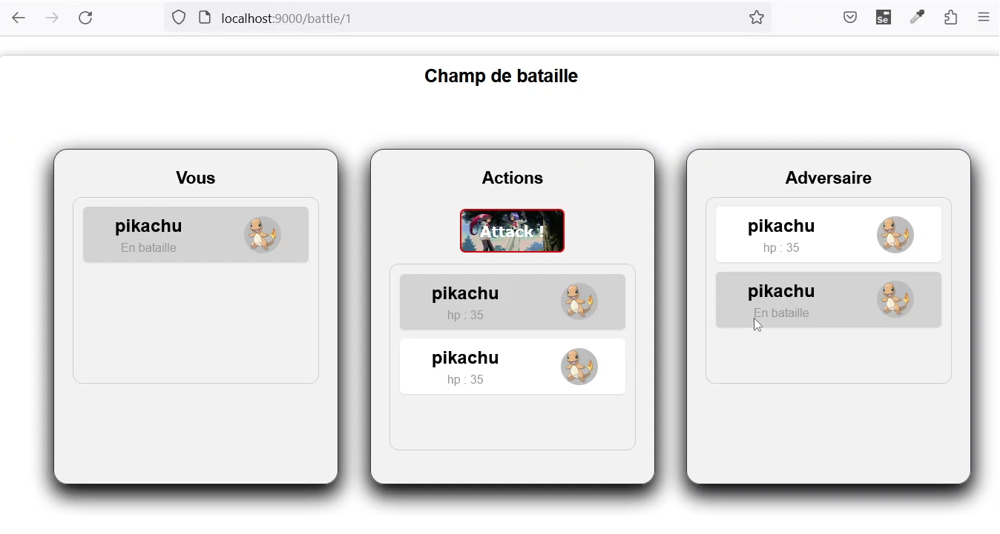

### PoC d'un jeu de combat en ligne

> :school: **Lieu de formation :** Université Paris Cité, Campus Grands Moulins (ex-Paris Diderot)
>
> :pushpin: **Année scolaire :** M2
> 
> :calendar: **Dates :** Janvier - Mars 2023 

#### Description
Un jeu multijoueur en ligne qui permet à chaque joueur de créer une équipe de Pokémon et de se battre contre les équipes des autres joueurs. 
L'application s'interface avec la PokéAPI pour construire le profil de chaque Pokémon de l'équipe.
Le PoC comprenait un pipeline CI/CD, ainsi que des tests unitaires.

#### Technologies
- TypeScript
- React
- Prisma
- GitLab CI/CD

#### Prérequis
- Node.js
- Yarn
- Docker

#### Installation de l'API
- `cd apps/api` 
- `yarn install` 
- `yarn db:start`
- `yarn db:migrate` 
- `yarn dev` 

#### Tests unitaires
- `yarn test`

#### Déploiement de l'API
- `yarn build`
- Tous les fichiers compilés se trouvent sous `/dist`. 
- Après avoir déployé `/dist` : `yarn start`

#### Installation des paquets

- `yarn add pokenode-ts` : Pour intégrer l'application avec la PokéAPI (Source : https://github.com/Gabb-c/pokenode-ts)
